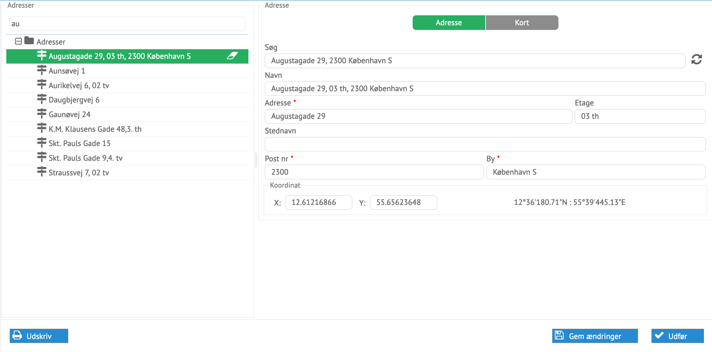
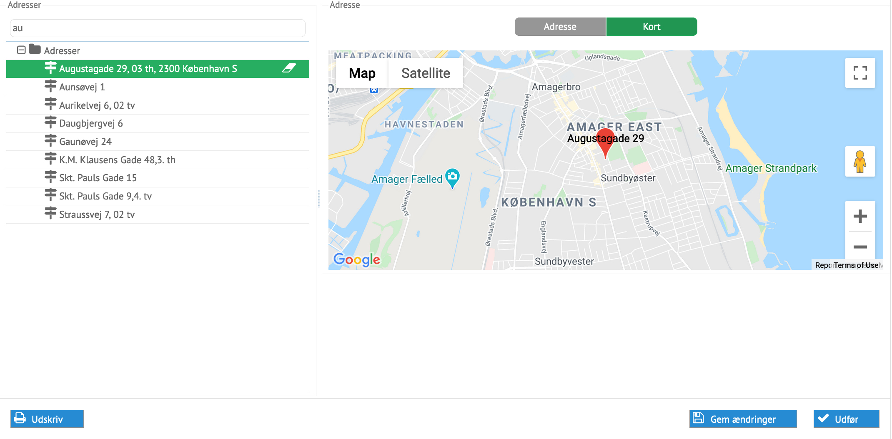

# Administration af adresser

Adresser kan oprettes, afsluttes og ændres i processen for administration af
adresser.

*Eksempel på en adresse klar til at blive ændret og opdateret fra addresse service*

Alle data kan ændres her direkte. Typisk vil man hente adresserne fra den
officielle adresseservice. Manuelle ændringer kan foretages til Etage som ikke
opdateres automatisk.
Ved udlandske adresser kan adressen blot angives manuelt.

*Eksempel på en adresse hvor X og Y koordinaterne kendes*

Data som kommer fra eksterne systemer, vil overskrive ændringerne næste gang
integrationer udføres. Der er normalt ingen automatisk opdateringer af adresser
da de ændres meget sjældent.