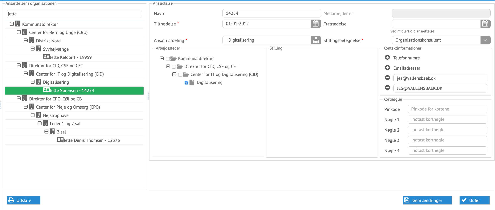

# Administration af ansættelser

Ansættelser kan oprettes, afsluttes og ændres i processen for administration af
ansættelser.

*Eksempel på en ansættelse klar til at blive ændret*

Alle data kan ændres her direkte. Typisk vil det være ansættelsens kontakt- og
kortdata som man vil administrere på ansættelserne.

Data som kommer fra eksterne systemer, vil overskrive ændringerne næste gang
integrationer udføres.