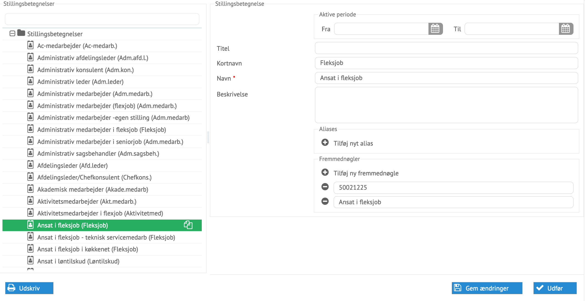

# Administration af stillingsbetegnelser

Stillingsbetegnelser kan oprettes, afsluttes og ændres i processen for
administration af stillingsbetegnelser.

*Eksempel på en stilling klar til at blive ændret*

Alle data kan ændres her direkte. Stillingerne kommer typisk fra lønsystemet og
opdateres ved her gang integrationen udføres.
Det er muligt at tilføje et Reflective sæt af stillinger, der kan administreres
separat, hvorved ansættelserne har mulighed for at benytte en stilling, der
kan benyttes til f.eks. mail footer.
