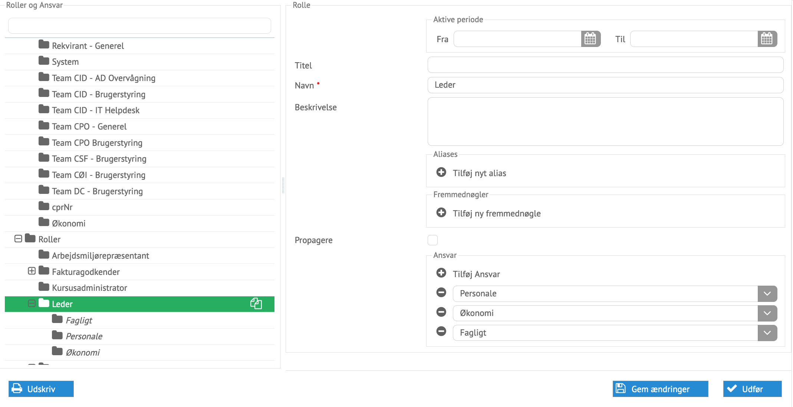

# Administration af roller og ansvar

Roller og ansvar kan oprettes, afsluttes og ændres i processen for administration
af roller og ansvar. Rollerne er forretningsbegreber der samler ansvar.

*Eksempel på en rolle klar til at blive ændret*

Alle data kan ændres her direkte. Nogle roller og ansvar kommer fra eksterne
systemer, som rollekataloget. Ansvarene benyttes til opdeling af opgaver ved
processafvikling, som f.eks. brugeroprettelsesopgaver, ved ansættelse.

Medarbejdere kan allokeres rolle/ansvar, der styre adgange til processer og
profiler.