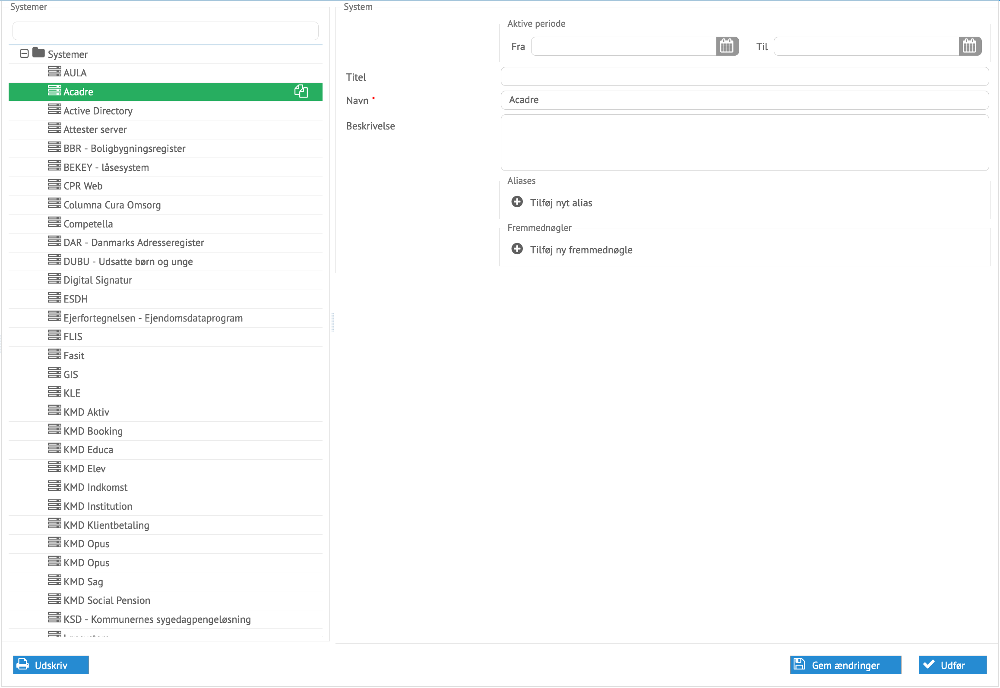

# Administration af systemer

Systemer kan oprettes, afsluttes og ændres i processen for administration
af systemer.

*Eksempel på et system klar til at blive ændret*

Alle data kan ændres her direkte. Nogle systemer kommer fra eksterne
systemer, så som Kitos. Et system benyttes b.la. som samler af alle de adgange
og profiler, der benyttes til brugeradministration for det pågældende system.
