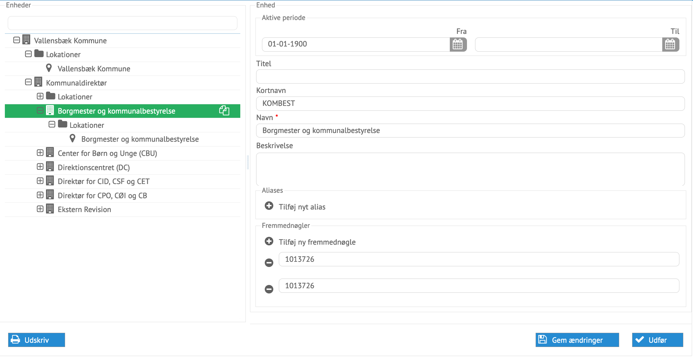

# Administration af afdelinger og lokationer

Afdelinger og tilhørende lokationer kan oprettes, afsluttes og ændres i
processen for administration af enheder.

*Eksempel på en afdeling klar til at blive ændret*

Alle data kan ændres her direkte. Lokationer og deres adresser administreres
også fra denne process.

Data som kommer fra eksterne systemer, vil overskrive ændringerne næste gang
integrationer udføres. Adfelingens navn kan overskrives med titel.