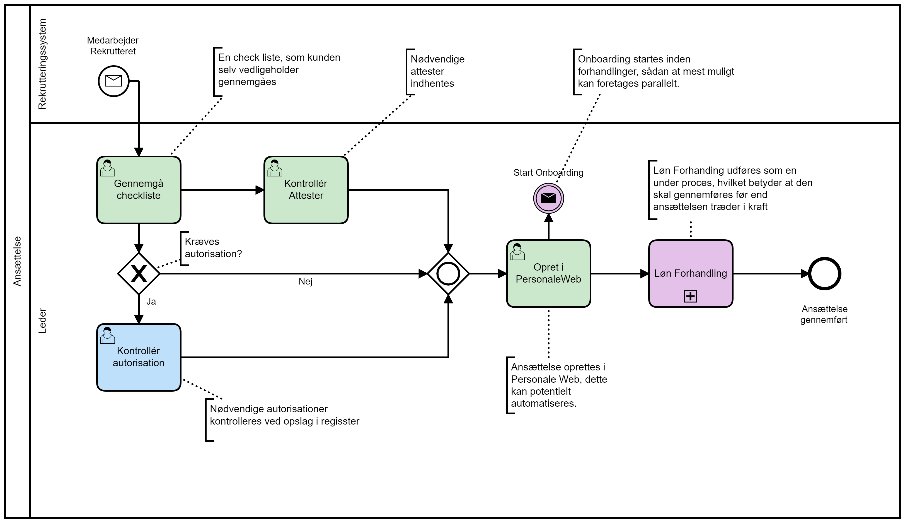
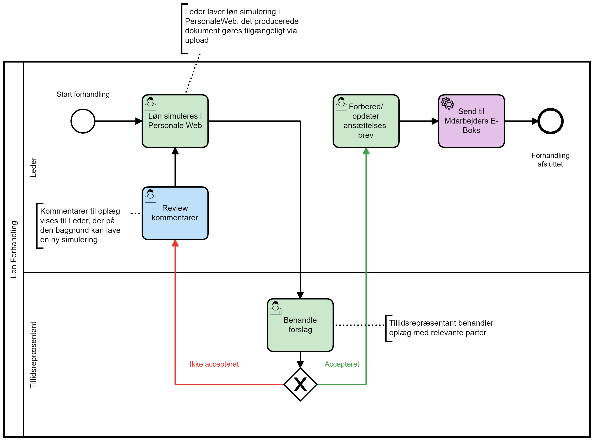
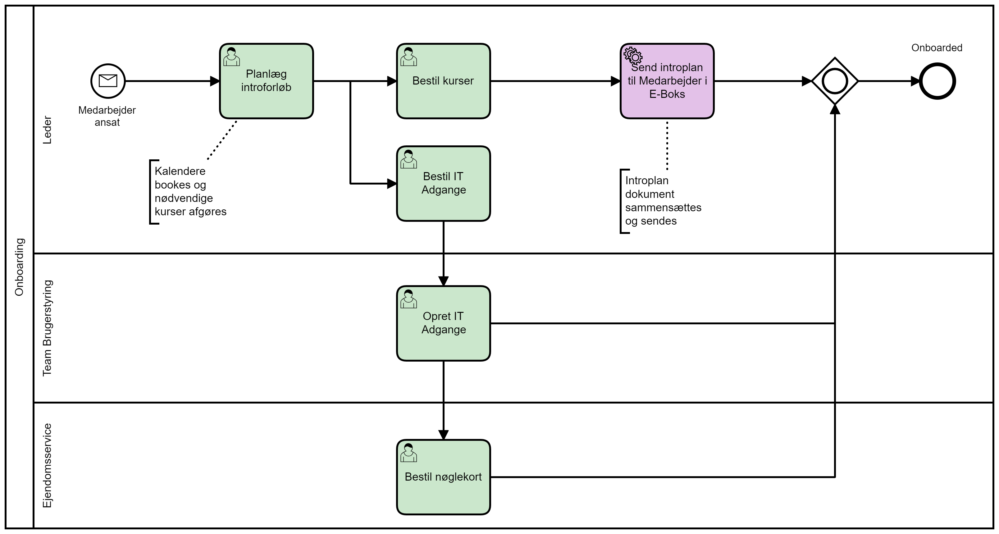

# Processer
Dokumentet indeholder processer som skitseret på Workshop.
De er ment som inspiration til hvordan en Region kan få deres større tværorganisatoriske og tværsystem processer implementeret

Processerne er sammenhængende ved at at Løn Forhandling indgår som subproces i ansættelse og Onboarding startes som en konsekvens af afsluttet ansættelse.

## Ansættelse

## Løn Forhandling

## Onboarding
Der skal styr på mange ting i forbindelse med onboarding.
Processen her viser et par eksempler, men er formentligt langtfra udtømmende ift. hvad en region skal have udført.

Man kunne tilføj bestilling af udstyr, nøglekort, kantinetilmelding etc. etc.

Alle bestillinger kunne med fordel kombineres i ét trin,
men er her vist separat for at demonstrere fordelene ved at kunne indbygge afhængigheder mens der er styr på udførelse.

