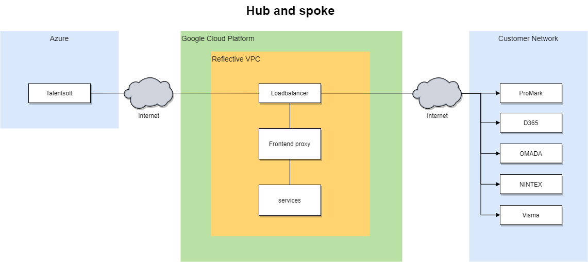

# Bankdata Case
Kunden stod overfor at skulle implementere et ERP system kompleks.

Her havde man gået med 'best of breed' produkter på forskellige områder indenfor for ERP, fremfor at vælge en monolit løsning med et bestemt fokus.

Fordelen ved dette approach er at man får systemer der er tilpasset til aktørerne der er involveret i ERP løsningen direkte.

Det er en stor fordel, det medfører dog nogle risici, som Reflective Platform addreserer, som beskrevet i [denne artikel](https://www.linkedin.com/post/edit/6769200825794379776/).

De uensartede systemer i dette kompleks har også uensartede data modeller der skal sammenstilles.
Her kommer Reflective Platform ind og får skabt det rette flow af kildedata og en enkel, sammenstillet datamodel.

Med 'one version of the truth' er det nemt at tilføje yderligere systemer som modtagere og at tilføje flere processer der skal digitaliseres.

*Hub and spoke arkitektur*