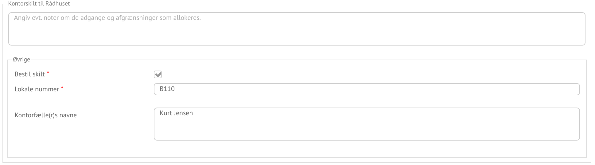
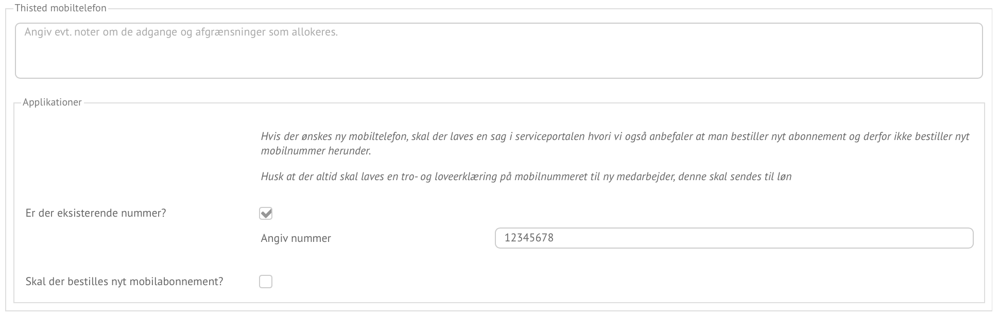
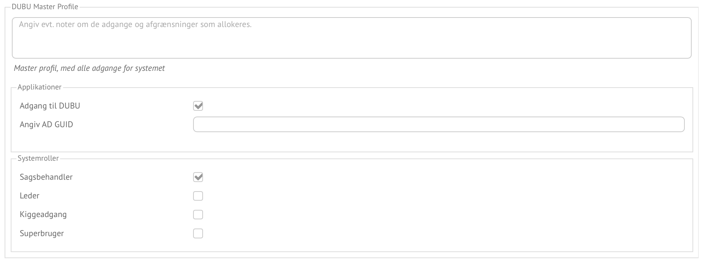
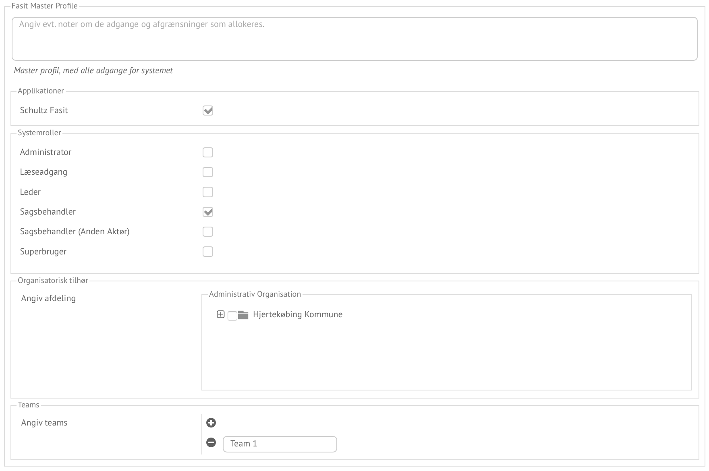

## Eksempler på profiler ##

Profiler kommer i flere varianter, men har alle samme muligheder for opbygning
og tilpasning til målgrupper, ved organisatorisk afgrænsning. Generelt har
profiler samme "livscyklus":

- Opbygning af profile med informations/adgangs elementer og tilpasning af
  profilens målgrupper
- UdVælgelse af en profile, og tilpassing af data
- Udførelse af profilen af modtageren

Det første skridt, er opsætning, hvor de to andre er hhv. rekviration og
udførsel.

### Manuelle profiler ###

_Manuelle profiler_ skal forståes som manuellet ved at brugen/udførelsen af
profilen. Det information profilen holder, er beregnet for en medarbejder som
skal læse, og evt. udføre noget på baggrund af profilen. Det kunne være
informationer som et system skal opdateres med, udstyr som skal udleveres,
regler medarbejderen skal være opmærksom på, osv.

*Profile for udarbejdelse af kontorskilt*

Mange opgaver vil i sagens natur, være manuelle da det kræver at en medarbejder
skal udføre noget arbejde som ikke kan automatiseres i organisationen.

*Profile for registrering og udlevering af mobiltelefon*

Når udleveringen af udstyr sker via profiler, vil Reflective Organisation
holde informationen om profilen, således at den kan benyttes ved ændringer
tilansættelsen. Det er derfor også muligt for den udførende at lave ændringer
til profilens data, så det svar til de faktiske forhold. Dette kunne være
serienumre om udstyret. Ud over at udlever udstyret, vil der ofte også være en
opgave med at registrer / rekvirer udstyret i et fagsystem. Denne del kan
automatiseres, hvorved profilen kan gøre delvis, eller helt automatisk.

*Profile som lister de kurser og regler, der gælder for stillingen*

Som nyansat, er der ofte et introduktionsforløb, hvor regler og informationer om
kurser formidles. Det er ikke tænkt at profiler skal holde data, men blot
være tovholder og formidle af hvor informationerne kan findes.

Man skal være opmærksom på at de hver af disse manuelle profiler, vil være et
bestillingsskridt, hvor det information som går til udføren er blevet tilpasset
evt. med en tilhørende kommentar.

### Automatiske bruger profiler ###

_Automatiske profiler_ består kun af et bestilling af fx adgange til et system.
Tildelingen af adgangen sker ved i dette tilfælde opdatering af medarbejderens
bruger til de rette grupper i Active Directory.

*Profil for DUBU*

Når den lederen / adminstrative medarbejder har udfyldt profilen, vil de rette
adgange blive givet til medarbejderen, uden yderlige opgaver. Profilen genbruges
ved ændring af ansættelsen, og adgange kan nedlægges automatisk.

### Organisatorisk afgrænsning af profiler ###

_Afgrænsning af profiler_ har til formål, at rette profiler som er relevante for
hvor i organisation og hvilken medarbejder det drejer sig om. Det skal være
informationer, som er relevant for den lokale leder og administrative
medarbejdere således administrationen kan ske hurtigt og uden fejl.

Afgrænsningerne er baseret på organisationsdata, som:

- Hvor medarbejderen er ansat i organisationen
- Stilling / job titel
- Rolle /Ansvar
- Afdelingens opgaver, KLE

Listen er ikke fast og vil blive udvidet som nye data tilføjes, til den
administrative databrønd i Reflective Organisation.

For at illustrer hvordan afgrænsninger giver værdi, benyttes her et eksemple med
Fasit fra Herlev Kommune.

*Generel profil for Fasit*

Men den generelle profil, kan man angive alt, og samtidig svær at automatisere
da det er afhængig af hvor medarbejderen ansættes i organisationen. Den måde
Fasit benyttes i Herlev Kommune under Jobcenter hvor de underligende teams afgør
hvilke grupper i Active Directory medarbejderens bruger skal tilknyttes. Ved at
definere Fasit profiler for hvert team, med opsætningen af de mulige roller, som
benyttes af de enkelte teams er det muligt at understøtte de forskellige behov,
der er per team, samtidig med at adgangen kan opsættes automatisk.

Her vises tre teams, og de regler som gælder. Samme eksemple benyttes i afsnittet
om opbygningen af profiler, vha. profil editoren, hvor udvælgelsen af AD
grupperne fremgår.

Generelt for alle tre eksempler gælder at medarbejderen skal være i gruppen
 `SIK_Fasit_Adgang` for overhoved at få adgang til Fasit. Alle teams profilerne
har rollen sagsbehandler, som navngives Sagsbehandler i profilen, men den
underliggende AD gruppe der er i spil, variere alt efter team:
`SIK_C.JUB_Jobcenter_Fleksjobteam`, `SIK_C.JUB_Jobcenter_Integrationsteam`, osv.

*Fasit profil for Fleksjobteam*

Nogle af profilerne giver mulighed for at angive Superbruger, Leder mm, som fx
Jobservice.

*Fasit profil for Jobservice*

Her kan flere medarbejde være tildelt rollen superbruger, hvor imod andre steder
må rollen kun tildeles én medarbejder. Der er p.t. ikke understøttelse denne
logik ved brugen af profiler, men kan fanges ved regler, på data og
brugerattestering.
