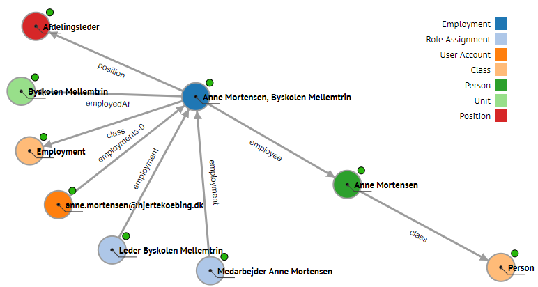
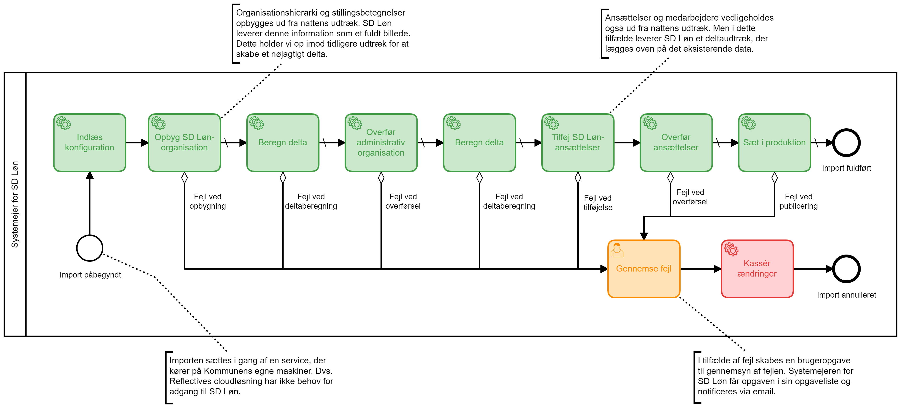

# Etablering af Integration
System integrationer indeholder nogle unikke udfordringer, der traditionelt er årsag til flere problemer.

Med Reflective Platform kan man undgå eller kraftigt reducere effekten af de typiske faldgruber.

## Integrering versus Ekstraktion
Der skelnes imellem Integrering, hvor en systeminstans er kilde til data og Ekstraktion hvor systeminstansen er modtager.

Selvom det kan være samme systeminstans vil implementationen være helt forskellige fra den ene til den anden situation,
da snitfladen til afsendelse eller modtagelse kan anvende forskellige data modeller og trinene i en Integrering versus en Ekstraktion er symmetrisk modsatte.

## Værdien

### Model værdi
Ved etablering evalueres data modeller involveret i en integration og hvor øvrige modeller kan genanvendes vil de blive taget i brug og kan dermed give en sammenhæng på tværs af kundens master data.

En attribut der anvendes i flere systemer vil blive den samme i den uniforme model og dermed danne udgangspunkt for at kunden kan skifte kilde eller modtager systemer for attributten.

Når først en model er dannet, så kan den udvikle sig over tid.

Tidligere modeller vil være tilgængelige, så man kan altid gå tilbage til hvordan data så ud før en evolution.

### Process og drift værdi
Alle trin i en integration foregår i en styret BPMN proces. De bliver udført i sekvens og man kan således, i tilfælde af et trin fejler, se den nøjagtige tilstand på det punkt hvor det fejler og kan endda genoptage integrationen fra det punkt.

*SDLøn import (Right-click, open in new tab to zoom)*

Således beskyttes mod potentiel tab af data, hvis man sammenligner med den traditionelle implementation hvor alle trin udføres i én volatil transaktion.

Det er nemt at debug hvor fejlen opstod, da processen er stoppet på det nøjagtige punkt og man har al data til grundlag for fejlen.

Processen er nem at styre i forhold til hvad der starter den og i tilfælde af at den er tidsstyret, hvor ofte og hvornår den kører.

Skal der tilføjes mere til processen, såsom notifikation af regelbrud i data, yderligere trin, igangsætning af andre processer mm. så har man efter etablering grundlaget til hurtigt at kunne tilføje det.

### Data værdi
Når en integration er etableret har man en komplet søgbar historik over alle udvekslinger imellem Reflective Platform og Systeminstansen.

Ændringer i data afspejles i perfekte difference registreringer der kun indeholder hvad der præcist er ændret.

Et eksempel er hvis et kilde system altid producerer et full load eller indeholder redundant data, så bliver denne støj filtreret og der dannes kun registrering af ændring ift. tilstanden af modellen på Reflective Platform.

Data kan dermed nemt analyseres for ændring over tid til dannelse af et delta udtræk.

## Integrationsopgaven
Samme opskrift bruges universelt til etablering og drift af integrationer.

De basale elementer i en integrationsopgave er følgende

1. Modellering og mapning af system instans
2. Opsætning af automatisk integrationsproces, der oversætter imellem data modeller
3. Parsing af indgående eller udgående data pakker uanset format
4. Udvikling af nødvendige endpoints til modtagelse eller udlevering af data
5. Adgange til nødvendige system brugere
6. Automatisk regressionstest af integration

Den basale del af opgaven kan udføres på under 15 timer med Reflective Platform

Den mere komplekse del er en modellering af data ift. forretningsmæssige domæne, der kan være udfordringer der kræver involvering af kunden.

For eksempel kan nogle software produkter kun beskrive én person per ansættelse, hvis kilden tilknytter flere personer per ansættelse, skal der træffes en beslutning med kunden om hvordan man vælger den ene tilknytning der skal overføres til målsystemet.

### Genbrug
Hvis Reflective Paltform i forvejen har en integration med et software product, så er meget af opgaven allerede udført og kan genbruges i stor stil.

Det er muligt da alle data modeller er i den samme kanoniske model og ofte genbruges samme Reflective Organization model, hvortil der allerede vil være mapninger.