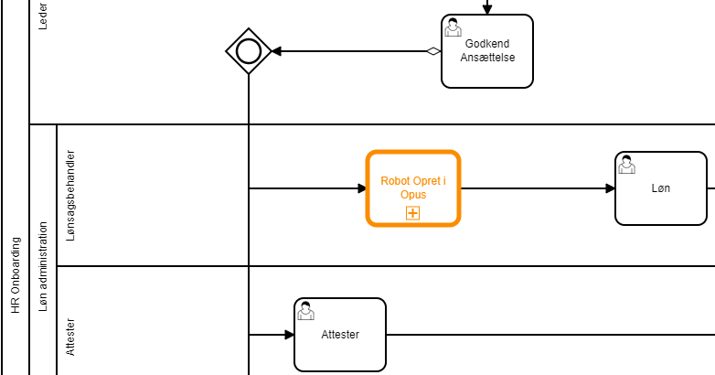
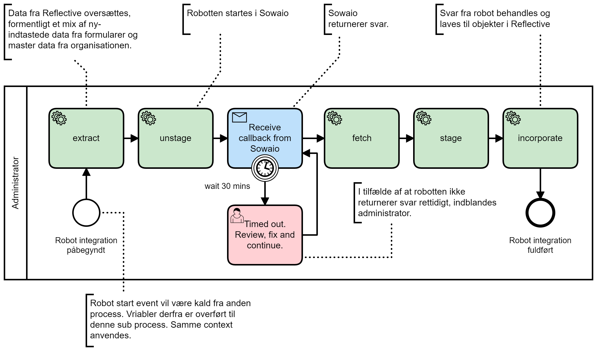
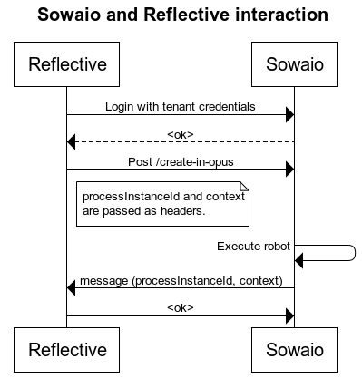

# Integration med SOWAIO RPA
Med denne integration kan man aktivere en RPA robot der for eksempel kan oprette en medarbejder i et løn system via en brugergrænseflade.

Det er anvendeligt i tilfælde hvor der ønskes en teknisk integration, men ikke findes et tilhørende tilgængeligt API.
Som, for eksempel, er tilfældet med OPUS Lønsystem.

## Process
Sowaio RPA integration inkluderes i en HR process via et kald til en subprocess.

På den måde er inklusionen enkel og uden kompleksitet som fejlhåndtering og andre tekniske dele der indgår i selve udførelsen.

*Eksempel på inklusion i HR process*

Selve robot processen er som vist her.

*Selve Robot integrations processen*

## Interaktion
Integrationen anvender HTTP api'er hos begge parter.

## Model
Et eksempel på anvendelse kan være oprettelse af Medarbejder i OPUS, hvor der returneres et medarbejderNr, som bagefter anvendes til at skabe en ansættelse.

I dette tilfælde er data til brug for robot eksekvering bestemt af OPUS brugergrænseflade.
Der kan tilmed ske oversættelse af stamdata tabeller, som kun er kendt af OPUS.