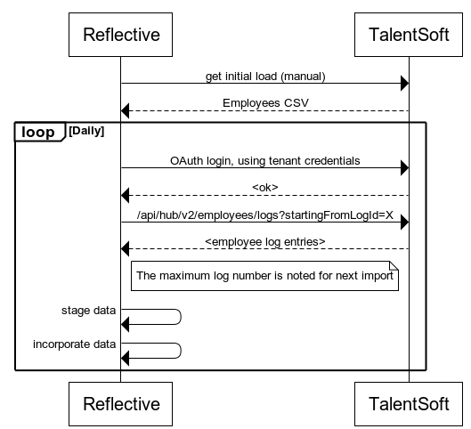

# TalentSoft to Reflective Integration

Reflective interprets all data from TalentSoft and respects the bitemporal nature.

Employees, Situation, Units, Geographic Locations and so on.

All of them are converted to the Reflective canonical model and made usable to integrate with any downstream system.

This enables TalentSoft as a major source in HR data for the tenant.

## Process
The process is an integration process, which means it runs automatically at a set interval.

*TalentSoft import (Right-click, open in new tab to zoom)*

## Model
The TS model is bitemporal and via changes over the TS log api, changes into the future are incorporated.

In this table, transformation from TS to RO uniform model are described on an entity level.
How the individual attributtes are mapped, is customized per tenant.

Entity source mapping.

| TS Entity           | RO Entity                 |
|---------------------|---------------------------|
| Employee            | Address, Person           |
| Employee.Situation  | Employment                |
| OrgUnit             | Unit                      |
| Geographic Location | Location                  |
| Position            | Position, Role Assignment |
| Regulation Name     | Team                      |

In case a position with specific values in Job or other determining attribute is mapped to do so, a Role Assignment is created with a given responsibility.
This is used for example to create a Role Assignment with 'manager' responsibility.

## Interaction
TS is an online Saas vendor, therefore APIs are expected to be robust and available 24/7.

Initial load from TS is done by manually exporting a CSV file of all employees in combination with an initial fetch of all logs from libraries.

Beyound the CSV file upload, all interaction is done by HTTP API.

