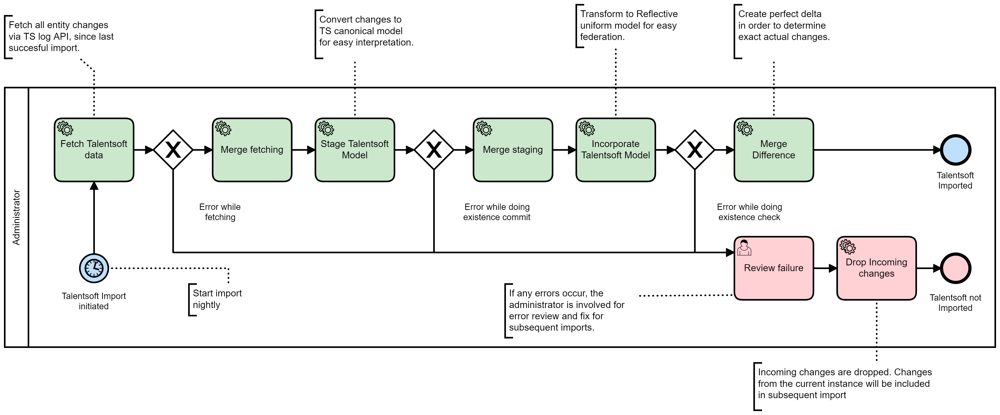

# TalentSoft to Reflective Integrationer

Reflective interprets all data from TalentSoft and respects the bitemporal nature.

Employees, Situation, Units, Geographic Locations and so on.

All of them are converted to Reflective canonical model and made usable to integrate with any downstream system.

This enables TalentSoft as a major source in HR data for the tenant.

## Process
The process is an integraiton process, which means it is automatically run at a set interval.

*TalentSoft import process*

## Model
### Employees
From talentsoft the Employe object becaomes the source for Person

## Interaction