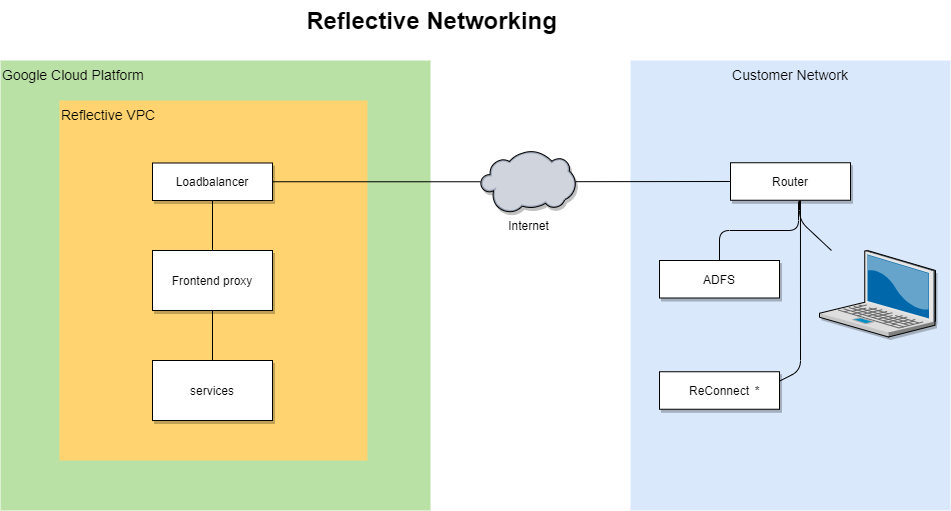
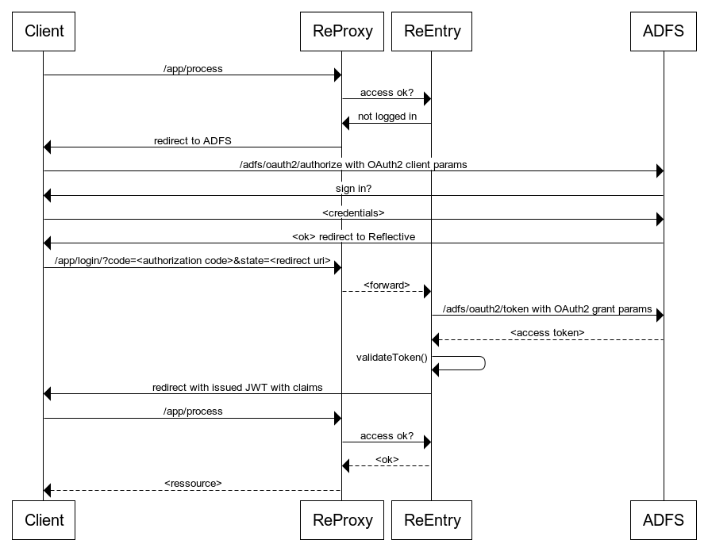

# Reflective netværk og sikkerhed
## Netværk

### ReConnect*
Denne komponent kommunikerer med Reflective Platform ved at kalde ud på nettet for at kunden ikke skal udstille et endpoint public på Internettet.

I integration med lokale systemer er ReConnect kontaktpunktet.
Det meste databehandling foregår på Reflective Platform og ReConnect er således blot det første/sidste led i en import eller export til/fra lokale systemer.

#### Integrationer
Hvor ofte opdateringer sker imellem systemer er bestemt af de individuelle integrationer.
For at opnå realtime opdatering er det nødvendigt at have en keep-alive connection. Hvilket betyder at servicen konstant har forbindelse.

#### Sikkerhed
Komponenten authenticater med en API key via OAuth2 og får udstedt et JWT token fra Reflective der udløber efter 2 timer.
Herefter vil challenge foretages igen ved nye forbindelser.

Forbindelse til lokale systemer kommer an på kravene for sikkerhed til de systemer.
## ADFS SSO
Sekvens for autentificering med ADFS

## Kunde segmentering
En kunde på Reflective platform har sit eget 'domain' eller muligvis flere domains hvis der er behov for det.
Hvert domain består af en række blockchains.
Blockchains er indekseret i en NoSQL database AeroSpike, hvor den bitemporale dimension er forud renderet.

Et domain id bliver claimed når en bruger hos kunden logger ind.

På platformen er alle blockchains kun refererbare via en crypto hash, som skal resolves igennem 'winch' servicen med et validt token.

For at læse data fra AeroSpike databasen, bliver man først valideret i en frontend service som f.eks.
Search servicen, som søger med domain id fra det token som det autentificerede kald bærer med sig.
