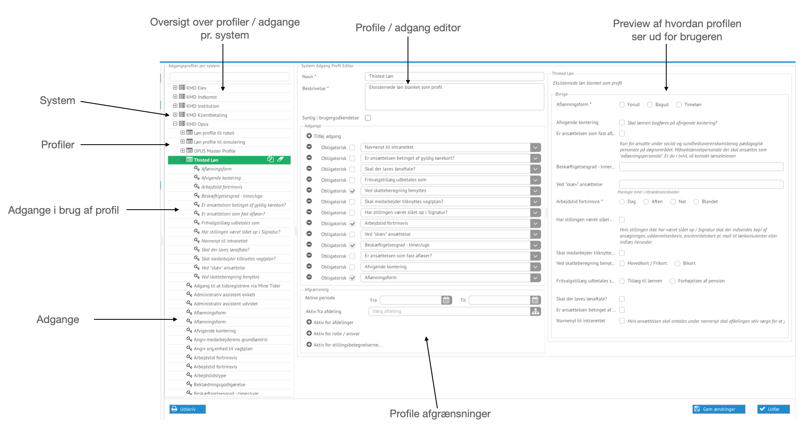
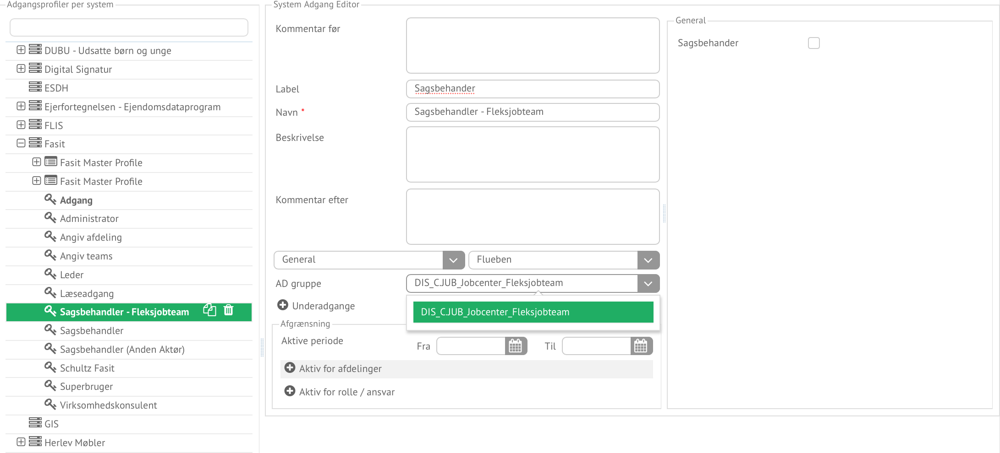

## Opbygning af profiler ##

_Opbygning af profiler_ og deres afgrænsninger foregår vha. processen:
_Profile administration_, som startes i Task Manageren, som alle andre
administrative processer, eller arbejdsgange, såfremt man har adgang til
funktionaliteten.

*Start af profile administration i taskmanager*

### Profileditor ###

Profiler kan oprettes og vedligeholdes, vha. _Profileditoren_, hvor profilerne
og tilhørende adgange, er organiseret under deres tilhørende systemer. Editoren
kan både opbygge profiler, og adgange. Profilerne opbygges ud fra adgange, og
hvilke afgrænsninger der skal gælde, dvs. hvem er profilen rettet imod.

*Profileditor overblik*

_Profileeditoren_ er opbygget af en editor del, og en preview, hvor man kan se
hvordan adgangen eller profilen kommer til at se ud. Adgange kan genbruges i
flere profiler, under sammen system, men kun ved manuelle profiler, hvor
adgangen ikke har en specifik betydning, som benyttes af en teknisk integration.

De adgangstyper som findes p.t. er rettet imod brugerprofiler, men vil løbende
blive udvidet, til også at kunne udpege dokumenter, som vil blive benytte i
tovholder arbejdsgange, hvor dokumenter på intranettet skal refereres.

### Opbygning af brugerprofiler ###

Brugerprofilerne for Fasit, som er beskrevet under eksempler, vises i det
efterfølgende hvordan de er opbygget, med editoren.

#### Opbygning af Fasit adgange ####

Det første der skal oprettes er selve adgange til facit, som angiver hvilken AD
gruppe der giver adgangen.

*Initiel Fasit adgang, som er adgangsgivende til systemet*

Der ud over skal der oprettes adgange for: Leder, Superbruger og Sagsbehandlere
adgange, som variere alt efter hvilken profil de benyttes i. Afgrænsninger
foregår på profil niveau, så ved at oprette Sagsbehandler adgange for hvert team
kan de benyttes i de rette profiler.

*Sagsbehandler adgang for fleksjobteam*

Når der er flere variationer af samme rolle, i dette tilfælde: Sagsbehandler,
er det muligt at benytte Label, som det brugervendte navn, og navn som teknisk
identifikation. For adgangene: Leder, Superbruger og Adgang til systemet Fasit,
som ikke adskilder sig ift. hvilken AD gruppe de peger på, kan navn blot bruges.

#### Opbygning af Fasit profiler ####

Når alle adgangen er bygget kan profilerne, laves ud fra adgangene, og afgrænses.

*Fasit profil for medarbejder der ansættes i fleksteam*

Profilen, opbygges ved at udvælge de oprettede adgange, i dette tilfælde:

- Adgang
- Sagsbehandler
- Superbruger
- Leder

Adgang til systemet, er gjort obligatorisk, hvorved profilen kun kan gemmes når
der er givet adgang, og derefter en af rollerne som medarbejderen skal udfører.

Brugen af denne profil, sker ved at den præsenteres for lederen / administrativ
medarbejderen, som er ved at ansætte en ny medarbejder til fleksteam. Når der
foretages administrative ændringer til adgange, til den profil som er relevant
også blive benyttet. Dette vil sikre at der kun præsenteres relevante
data, og muliggør, automatiseringer, som i dette tilfælde.

Afgrænsningen er i det viste eksemple kun gjort på hvilken afdeling den er
gældende fra, hvilken vil være dækkende for langt de fleste tilfælde.

Der er også understyttelse, for at en profil, har en tilhørende standard/initiel
allokering, således at profilen er præudfyldt med det som 80+ har brug for af
adgange. Denne funktionalitet, vil blive gjort tilgængelig via UX på et senere
tidspunkt.