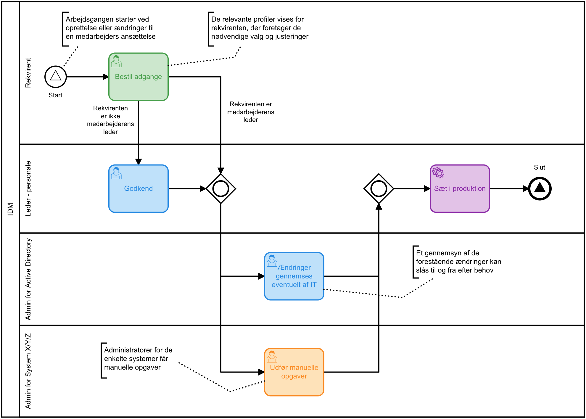

# Løsningsbeskrivelse for _IDM_

Dette er en del af en samlet løsningsbeskrivelse af Reflectives kommunale
brancheløsning, der omhandler _IDM_. Den overordnede løsningsbeskrivelse findes
her: [Overordnet løsningsbeskrivelse](solutions/loesningsbeskrivelse.md).

## Indledning

Formålet med et IDM-system, eller _Identity Management_-system, er grundlæggende
at håndtere organisationens brugere og rettigheder på en betryggende måde, der er
fleksibel, skaber et godt overblik og lever op til lovgivningen, herunder
_Persondataforordningen_ (GDPR).

I Reflective håndteres rettigheder gennem administration og tildeling af
systemer, profiler og adgange. Al nødvendig konfiguration kan skræddersys til den
enkelte kunde, eller håndteres af kunden selv. Mere om det nedenfor.

Ved at sammenkoble  adgangstildelinger med information om den enkelte ansattes
indplacering i organisationen, stilling, roller og ansvar, skabes et unikt
overblik for ledere og de systemansvarlige, fordi de kun skal forholde sig til
relevant information, både ved tildeling og den periodiske attestering.

## Eksterne data

Hvis kommunen vedligeholder f.eks. systemer og roller i ét eller flere eksterne
systemer, kan data læses ind i Reflective ved et initielt load eller
synkroniseres løbende gennem en integration, hvis de øvrige systemer fortsat skal
være autoritativ kilde til denne information.

Hvis Reflective ikke allerede har en integration til det pågældende system, er
det normalt ikke svært at etablere en, såfremt systemet kan levere et udtræk
eller har et tilgængeligt API. Nye integrationer kan med fordel håndteres igennem
ERFA-gruppen, Reflectives kommunale kundekreds.

Læs mere om integrationer her:
[Integrationer](solutions/loesningsbeskrivelse-integrationer.md).

## Administration og vedligehold

Administration og vedligehold af systemer og adgange i Reflective foregår gennem
målrettede administrationsprocesser og en fleksibel profilbygger, hvor kommunen
enten selv eller i samarbejde med Reflective kan definere de nødvendige profiler
og adgange så detaljeret som nødvendigt.

Læs mere om processer her:
[Processer](solutions/loesningsbeskrivelse-processer.md) og løsningens
brugergrænseflader her:
[Brugergrænseflader](solutions/loesningsbeskrivelse-brugergraenseflader.md).

## Begreber

### Systemer

Et _System_ er i Reflective et bredere begreb end i mange andre
IDM-løsninger. Det omfatter naturligvis almindelige IT-systemer, såsom Cura,
Acadre eller UniLock, men dækker også mere abstrakte størrelser som _Telefoni_ og
_KLE Opmærkning_. Grunden er, at mange af de samme principper og behov gør sig
gældende, selv om vi er vandt til at tænke systemerne ned i forskellige
kasser. Et telefonnummer kan betragtes som en adgang til Telefoni-systemet, og et
udvalg af KLE-emner kan betragtes som en adgang ind i KLE-verdenen; faktisk
bruges KLE-opmærkning netop til adgangsgivning (afgrænsning) i diverse
sagsbehandlingssystemer.

Fordelene ved at tænke _System_ lidt bredere er:

- Administration, visning og behandling af informationen følger de samme mønstre,
så løsningens brugere oplever en høj grad af genkendelighed.
- De samme værktøjer kan genbruges på kryds og tværs, hvilket øger løsningens
funktionalitet.
- Ledere og systemansvarlige kan periodisk attestere KLE-opmærkning, ressourcer
  o.lign. på samme måde som adgange til fagsystemerne. Dette løfter kvaliteten og
  sikkerheden.

### Profiler

En _Systemprofil_, eller bare _Profil_, er en målretning af et sæt specifikke
roller, adgange, ressourcer mv. i et konkret system. Og formålet med en profil
er at begrænse mængden af information, som løsningens brugere skal tage stilling
til i forskellige sammenhænge. Dette skaber et meget bedre overblik for ledere og
systemansvarlige og reducerer kraftigt risikoen for fejl.

Profiler kan målrettes helt ud til konkrete stillinger og roller bestemte steder
i organisationen, på baggrund af den information løsningen allerede har til
rådighed. F.eks. ved administration af adgange til en medarbejder, der er ansat
som tandlæge på en skole i kommunen, eller en IT-medarbejder, der har rollen som
systemansvarlig for et fagsystem.

Når de pågældendes ledere enten skal rekvirere nye adgange eller attestere
eksisterende, skal de kun forholde sig til profiler målrettet den konkrete
situation. Og det bliver pludselig meget synligt, hvis en medarbejder har nogle
uventede adgange fra atypiske profiler eller systemer.

### Adgange

En _Adgang_ i Reflective repræsenterer alt dét som i forskellige andre systemer
kaldes roller, adgange, rettigheder, ressourcer etc. Adgange er organiseret i
profiler (se ovenfor) og er altid tilknyttet et specifikt system.

Hvis det eksterne system internt tildeler rettigheder til sine brugere på
baggrund af gruppetilhør i Active Directory, så vil systemets adgange i løsningen
være knyttet til de relevante AD-grupper, så en adgangstildeling udmønter sig i
de rigtige gruppemedlemskaber i Active Directory.

Hvis systemet bruger en anden form for rettighedsstyring, skal løsningen
enten provisionere systemet gennem en integration, eller vedligeholdelsen skal
foretages som en manuel opgave.

Læs mere om integrationer her:
[Integrationer](solutions/loesningsbeskrivelse-integrationer.md) og processer
her: [Processer](solutions/loesningsbeskrivelse-processer.md).

### Adgangstildelinger

Rettigheder og adgange organiseres, som beskrevet ovenfor, vha. profiler
målrettet specifikke situationer. Den faktiske _tildeling_ af de relevante
adgange foregår enten i en forretningsvendt arbejdsgang eller i en
administrationsproces til oprettelse, ændring og nedlæggelse af eksisterende
adgange.

 _Forretningsvendt arbejdsgang til oprettelse og justeringer
af adgangstildelinger_

Den forretningsvendte arbejdsgang har et bestillingstrin, hvor en rekvirent
udpeger de nødvendige profiler og tilretter eventuelle detaljer, og et eller
flere udførselstrin, hvor løsningen automatisk skaber opgaverne og tildeler dem
de rette aktører. Hvis rekvirenten ikke er medarbejderens _leder_, kan der også
være et godkendertrin, hvor den nærmeste leder skal godkende de forestående
ændringer.

I bestillingstrinnet præsenteres rekvirenten som udgangspunkt kun for profiler
målrettet den relevante medarbejder (se afsnittet om profiler ovenfor). Ved tryk
på en knap _Øvrige profiler_ præsenteres rekvirenten for de andre profiler.

Udførselsopgaverne kan i nogle tilfælde eksekveres helt automatisk, som
f.eks. ved oprettelse af gruppetilhør i Active Directory, men hvis IT-afdelingen
gerne vil gennemse ændringerne, inden de føres ud i livet, kan løsningen
præsentere en rapport til godkendelse først. I andre tilfælde, hvor løsningen
ikke har en direkte integration endnu, bliver udførselsopgaven lagt som en manuel
opgave til den, der sidder som administrator for det pågældende system. Men i
alle tilfælde omhandler hver udførselsopgave kun de profiler, der er relevant for
den udførende aktør.

### Brugere

### Modellering af eksterne systemer og adgange

## IDM-livscyklus

### Rekvirering og tildeling

### Ændringer

Ændringer til tildeling eller pga. af flytning i organisationen eller ændringer
til ansættelser

### Periodisk attestering

### Midlertidigt ophør

### Sletning
