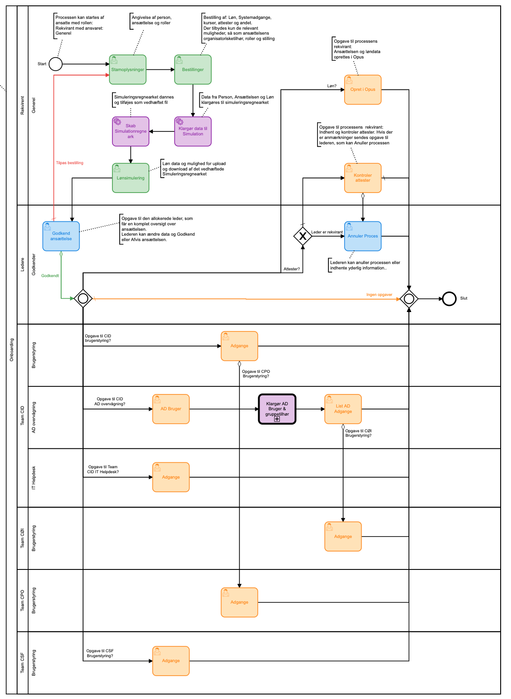
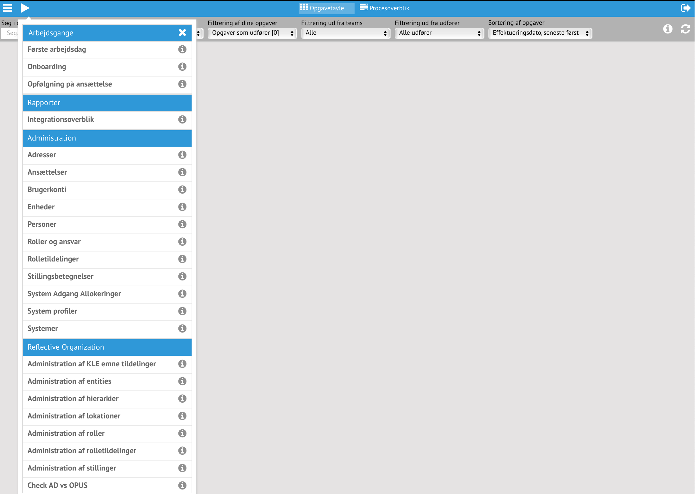
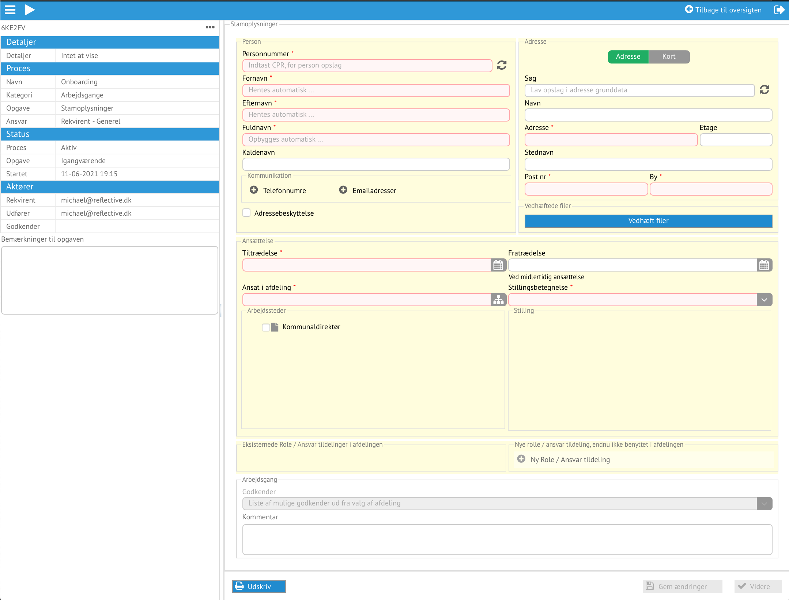

# Vallensbæk

For at tilgå Reflective benyttes den kundespecifikke adresse sat op til single
sign-on:

https://vallensbaek.reflective.dk

Det bringer start billedet med to muligheder

#include "generel.md"

## Onboarding

Reflective benytter standarder, og for at beskrive foretningsgange benyttes
standarden for det som er BPMN.

*Oversigt over arbejdsgangens opgaver i BPMN*

Her vises alle de opgaver som onboarding arbejdsgangen indeholder, hvordan de
hænger sammen og hvilke ansvar som er krævet for at kunne udfører opgaven.
De grønne opgaver er bestilling, de blå godkendelse, de lilla er automatiske og
gule er udførende opgaver, som at opdatere et system med adgange.

*Start onboarding arbejdsgangen start menuen*

Bestilleren starter en onboarding, fra start menuen.

*Stamoplysninger*

Den første opgave som automatisk tildeles bestilleren er stamoplysninger om
ansættelsen
