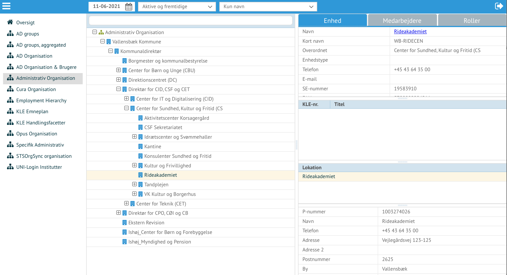
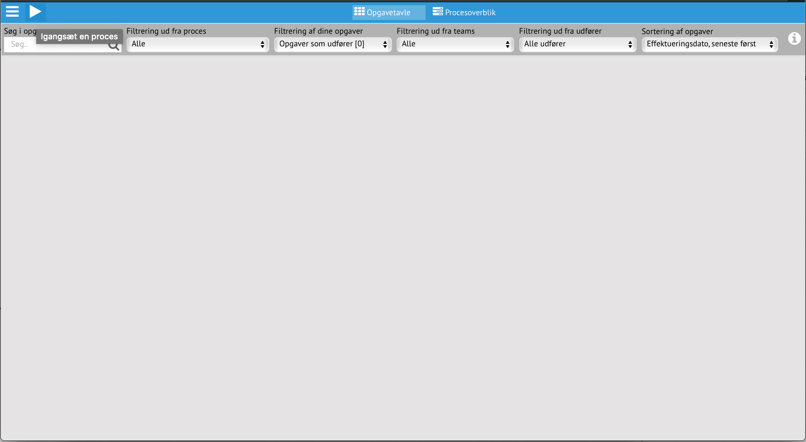
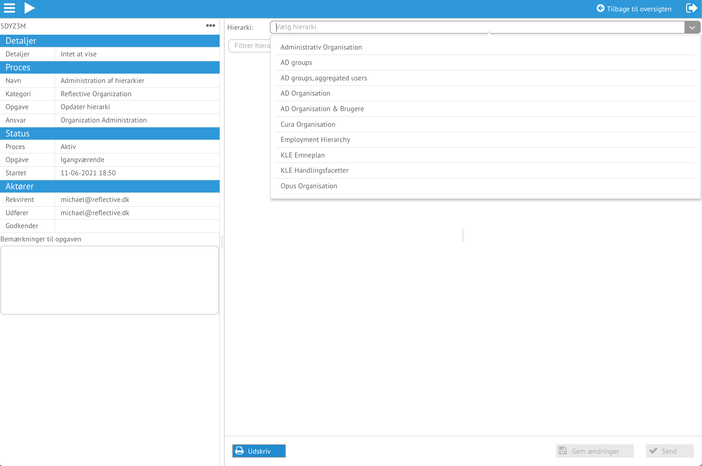
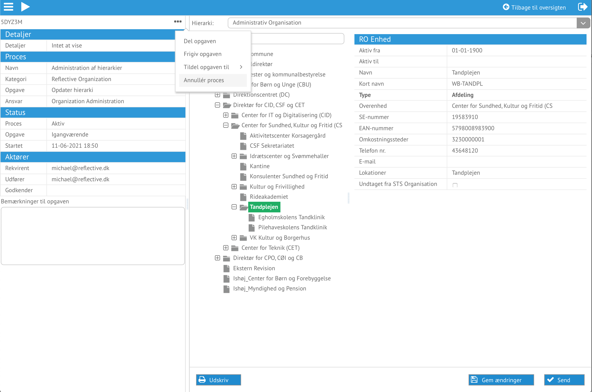

## Startside

*Reflective startside. Tandhjulet giver flere adgange*

 - Organization, giver adgang til visning af hierarkidata
 - Task manager, giver adgang til ændring af data

Det er muligt at få adgang til flere funktionalitetsområder ved at trykke på
tandhjulet. Hvilke muligheder, styrres af Reflective adgang pr bruger.
Overtagelsesprøverne udføres med bruger som har alle rettigheder.

## Organisations-/Hierarkiviser

Startsiden for organisations-/hierarkivisning, er en oversigt over hierarkier
til venstre og filter øverst.

*Startsiden for organisations-/hierarkivisning*

Efter et hierarki er valgt, er det muligt at navigere og søge i for at vise
detaljer.

*Administrativ Organisation inden søgning / navigering i data*

Her er Administrative Organisation valgt. Den øverste enhed er valg og træet er
åben. Data om den valgte enhed vises til højre.

*Administrativ Organisation åben og visning af specifik enhed*

Her er der blevet navigeret ned til Rideakademiet, som der vises detaljer om.

*AD Groups åben og visning af specifik gruppe*

Her vises AD groups, hvor det er filtreret til: "acadre tand".

For at komme over til Task Manageren benyttes menuen (de 3 hvide horisontale
linjer), hvorved funktionalitet til ændring af data stilles tilrådighed.

*Skift til Task Manager/Opgavehåndtering*

## Task Manager/Opgavehåndtering

Tomt start billede for Opgavehåndtering. Hvis der havde været kørende processer
med opgaver tildelt den bruger, der er logget på, ville der ligge opgavekort klar
til at arbejde med.

*Startsiden for Opgavehåndtering. Start/playikonet giver adgang til de processer som kan startes*

For at starte en ny proces, benyttes start/playikonet.

*Vælg Administration af hierarkier*

Ud fra listen over mulige data ændringsprocesser, vælges "Administration af
hierarkier".

*Ændringer kan gives en beskrivelse og hvornår ændringen træder ikraft*

Det er muligt at tilføje en beskrivelse af hvilke ændringer der skal udføres og
hvornår ændringerne har virkning, dvs. fra hvilket tidspunkt data bliver synlig
i data.

*Vælg hvilket hierarki der ønskes ændret*

Vælg det administrative hierarki, ud fra listen over hierarkier der kan ændres.

*Detaljer om Tandplejen*

Prøv at navigere til Tandplejen, og få vise data om enheden, ansatte og deres
roller.

*Annuller processen*

Der ønskes ikke lave ændringer. Da ejeren/starteren af processen kan annuller
den, forsvinder processens ene opgave som er allokeret til ejeren.
