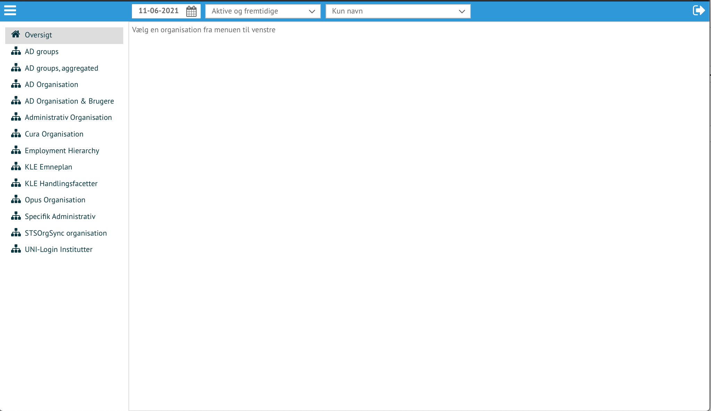
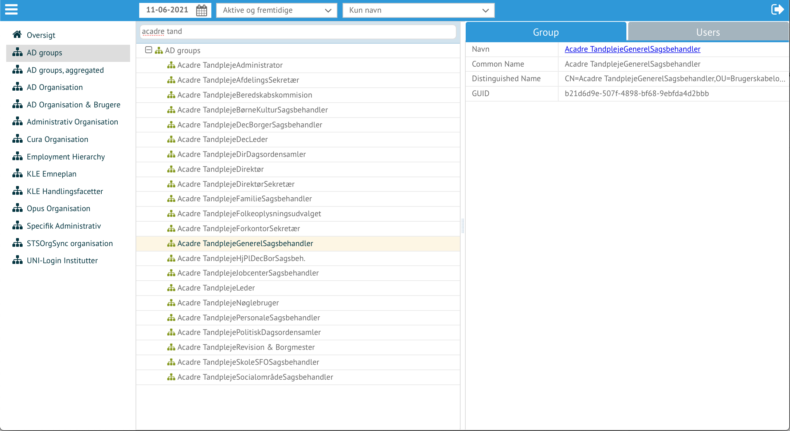

## Start side

*Reflective start side. Tandhjulet giver flere adgange*

 - Organization, giver adgang til visning af hierarkidata
 - Task manager, giver adgang til ændring af data

Det er muligt at få adgang til flere funktionalitetsområder ved at trykke på
tandhjulet. Hvilke muligheder, styrres af Reflective adgang pr bruger.
Overtagelsesprøverne udføres med bruger som har alle rettigheder.

## Organisation / Hierarki viser

Start siden for organisation/hierarki visning, er en oversigt over hierarkier
til venstre og filter øverst.

*Start siden for hierarkivisning*

Ved at vælge et hierarki, kan det navigeres og søges i for at vise detailjer.

*Administrativ Organisation inden søgning / navigering i data*

Her er Administrative Organisation valgt. Den øverste enhed er valg og træet er
åben. Data om den valgte enhed vises til højre.

*Administrativ Organisation åben og visning af specifik enhed*

git tat

*AD Groups åben og visning af specifik gruppe*

Ved at benytte menuen (de 3 hvide horisontale linier), kan Task Manager vælges,
hvorved funktionalitet til ændring af data stilles tilrådighed.

*Skift til Task Manager / Opgavehåndtering*

## Task Manager / Opgavehåndtering

*Start siden for opgavehåndtering. Play pilen giver adgang til de processer som kan startes*

*Vælg Administration af hierarkier*

*Ændringer kan gives en beskrivelse og hvornår ændringen træder ikraft*

*Vælg hvilket hierarki der ønskes ændret*

*Vælg hvilket hierarki der ønskes ændret*

*Annuller processen*

