# Reflective

For at tilgå reflective direkte uden single sigon, benyttes:

https://home.reflective.dk

## Start side

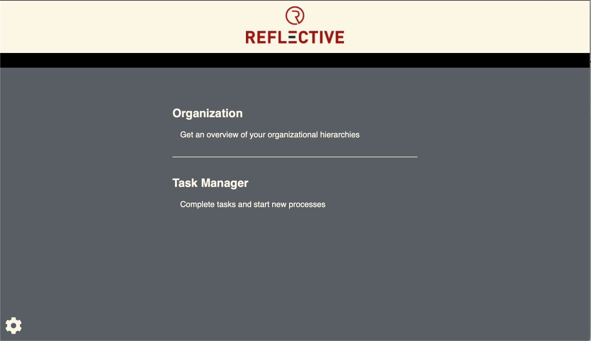
*Reflective start side. Tandhjulet giver flere adgange*

Organization, giver adgang til visning af hierarkidata.

## Organisation / Hierarki viser

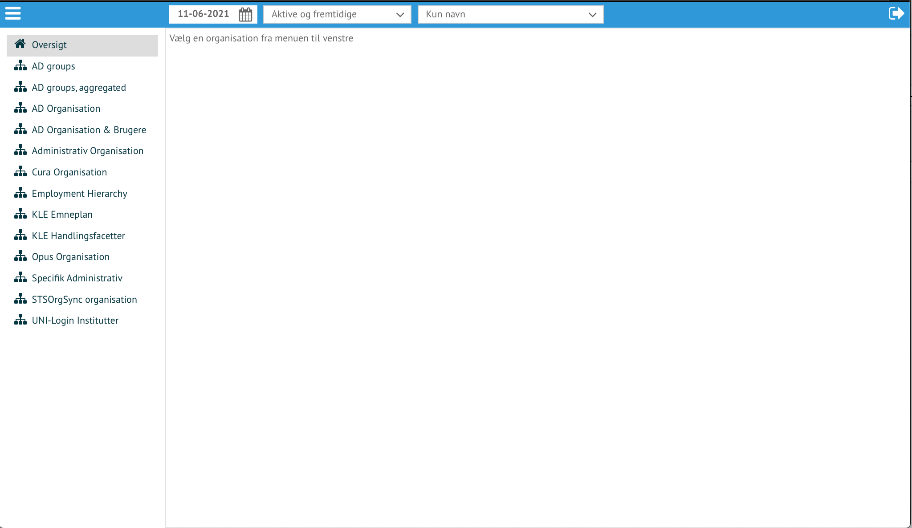
*Start siden for hierarkivisning*

Listen til venstre viser de hierarkier der er opbygget i reflective ud fra jeres
data. Vælg *Administrativ

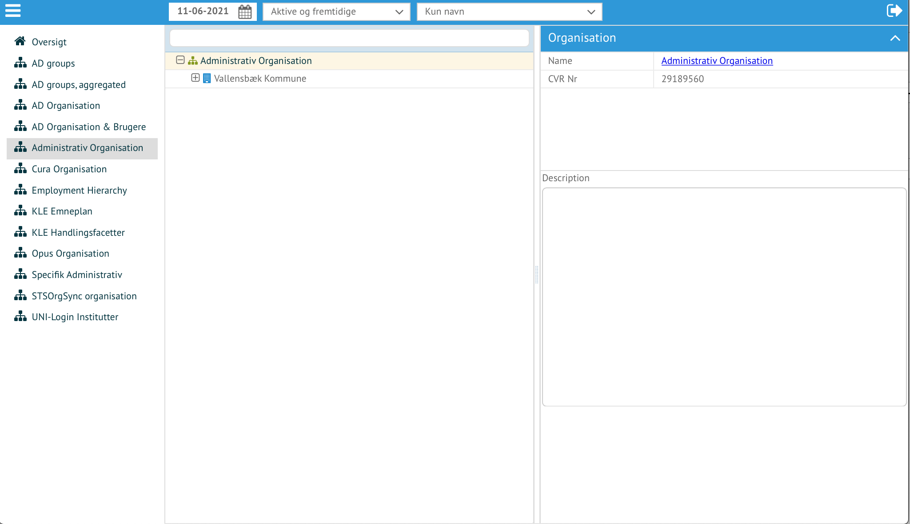
*Administrativ Organisation inden søgning / navigering i data*

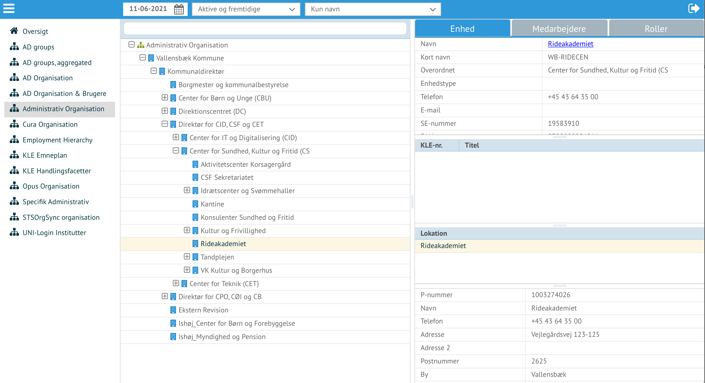
*Administrativ Organisation åben og visning af specifik enhed*

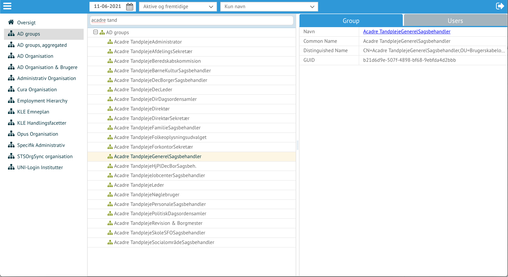
*AD Groups åben og visning af specifik gruppe*

Ved at benytte menuen (de 3 hvide horisontale linier), kan Task Manager vælges,
hvorved funktionalitet til ændring af data stilles tilrådighed.

*Skift til Task Manager / Opgavehåndtering*

## Task Manager / Opgavehåndtering

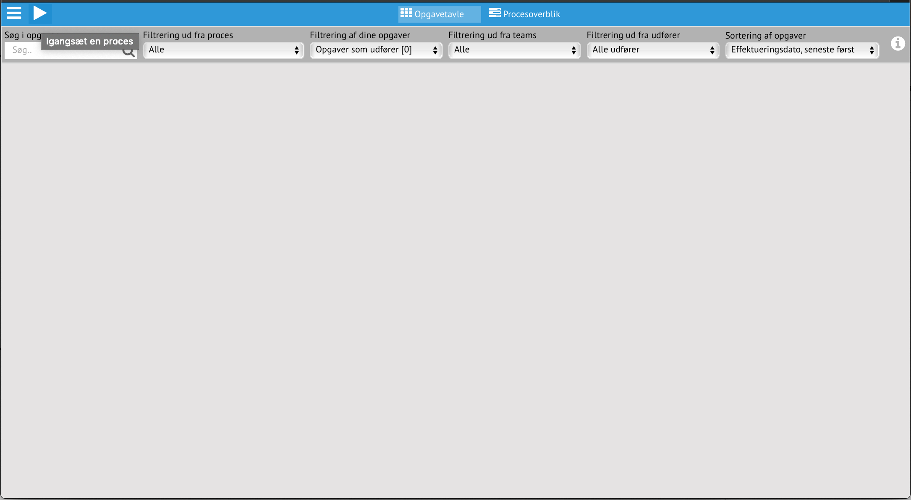
*Start siden for opgavehåndtering. Play pilen giver adgang til de processer som kan startes*

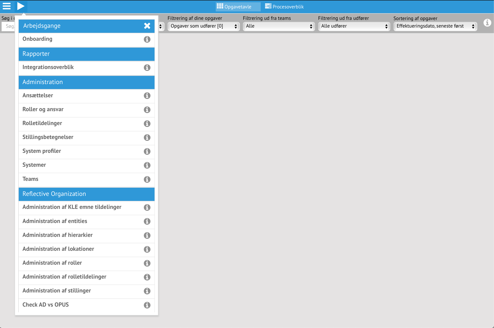
*Vælg Administration af hierarkier*

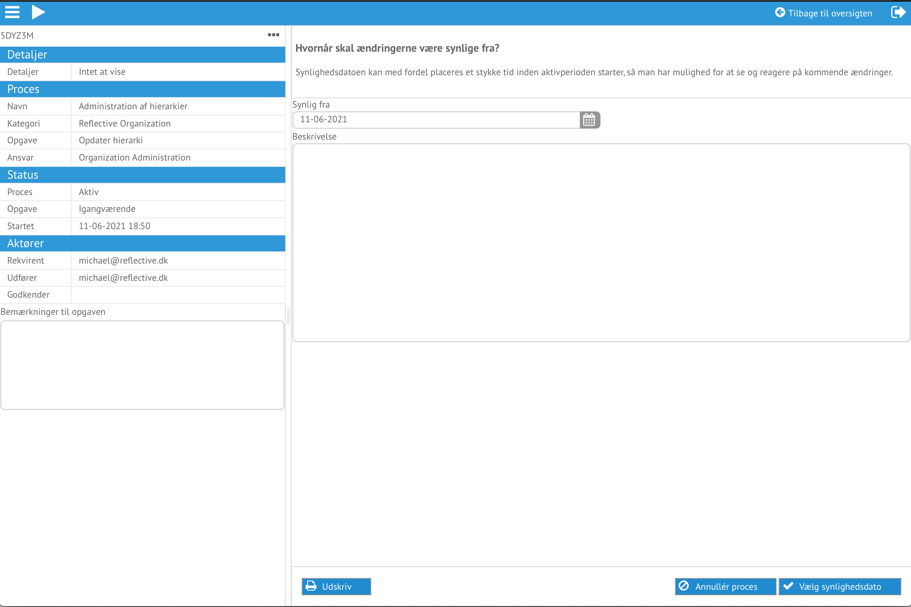
*Ændringer kan gives en beskrivelse og hvornår ændringen træder ikraft*

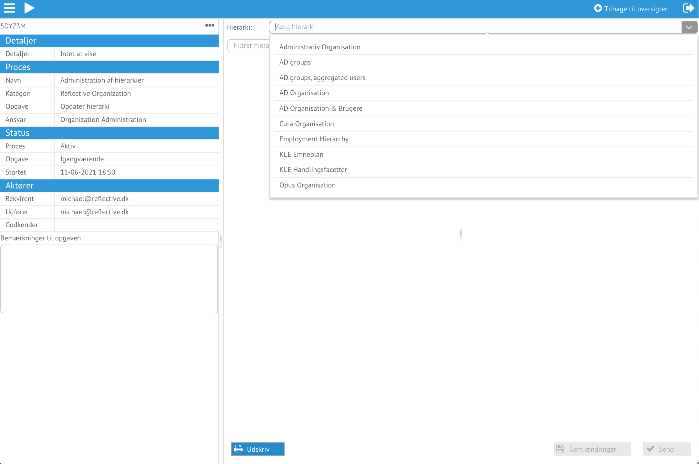
*Vælg hvilket hierarki der ønskes ændret*

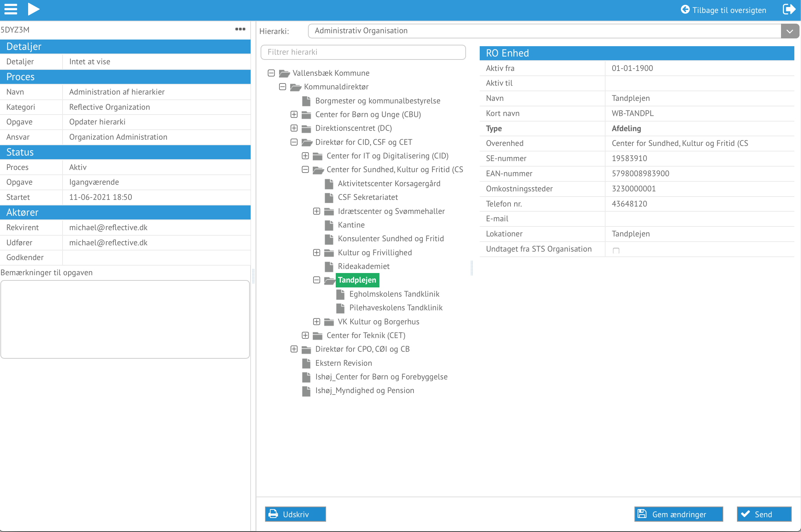
*Vælg hvilket hierarki der ønskes ændret*

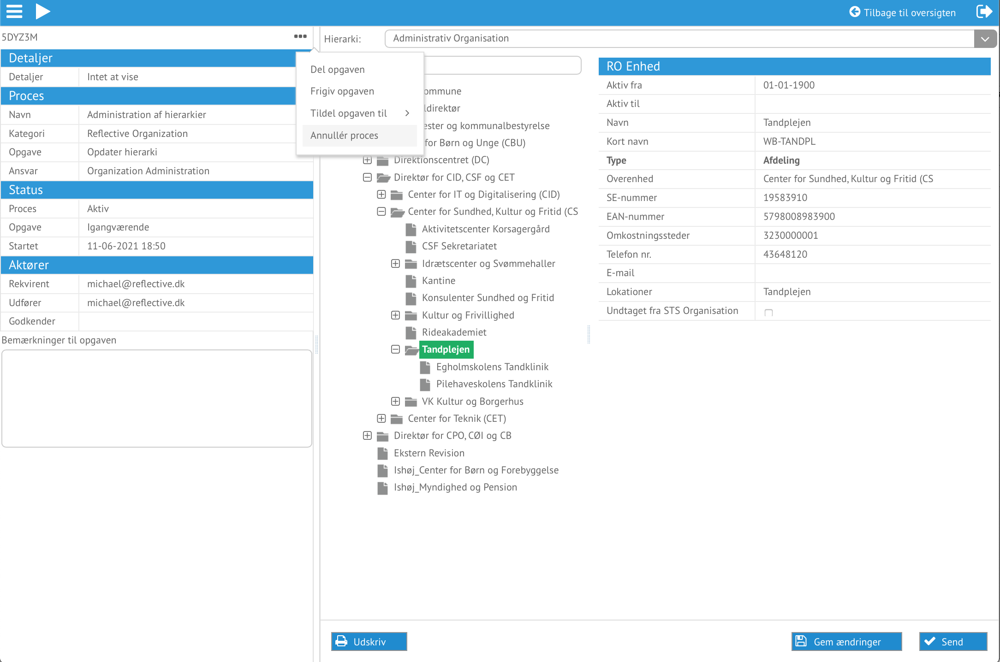
*Annuller processen*

