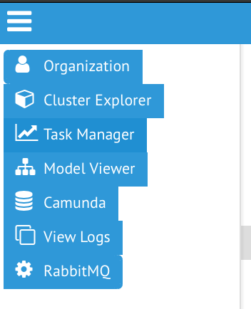

# Reflective

For at tilgå reflective direkte uden single sigon, benyttes:

https://home.reflective.dk

## Start side

*Reflective start side. Tandhjulet giver flere adgange*

 - Organization, giver adgang til visning af hierarkidata
 - Task manager, giver adgang til ændring af data

Det er muligt at få adgang til flere funktionalitetsområder ved at trykke på
tandhjulet. Hvilke muligheder, styrres af Reflective adgang pr bruger.
Overtagelsesprøverne udføres med bruger som har alle rettigheder.

## Organisation / Hierarki viser

Start siden for organisation/hierarki visning, er en oversigt over hierarkier
til venstre og filter øverst.

*Start siden for hierarkivisning*

Ved at vælge et hierarki, kan det navigeres og søges i for at vise detailjer.

*Administrativ Organisation inden søgning / navigering i data*

Her er Administrative Organisation valgt. Den øverste enhed er valg og træet er
åben. Data om den valgte enhed vises til højre.

*Administrativ Organisation åben og visning af specifik enhed*

Her er der blevet navigeret ned til Rideakademiet, som der vises detaljer om.

*AD Groups åben og visning af specifik gruppe*

Her vises AD groups, hvor det er filtreret til: "acadre tand".

For at komme over til Task manageren benyttee menuen (de 3 hvide horisontale
linier), hvorved funktionalitet til ændring af data stilles tilrådighed.

*Skift til Task Manager / Opgavehåndtering*

## Task Manager / Opgavehåndtering

Tomt start billede for opgavehåndtering. Hvis der havde været kørende processer
med opgaver tildelt til login'et, så ville der ligge opgave kort til at tilgå
og løse dem.

*Start siden for opgavehåndtering. Play pilen giver adgang til de processer som kan startes*

For at starte en ny process, benyttes start/play ikonet.

*Vælg Administration af hierarkier*

Ud fra listen over mulige data ændringsprocesser, vælges "Administration af
hierakier".

*Ændringer kan gives en beskrivelse og hvornår ændringen træder ikraft*

Det er muligt at tilføge en beskrivelse af hvilke ændringer der skal udføres og
hvornår ændringerne har virkning, dvs. fra hvilket tidspunkt data bliver synlig
i data.

*Vælg hvilket hierarki der ønskes ændret*

*Vælg hvilket hierarki der ønskes ændret*

*Annuller processen*

