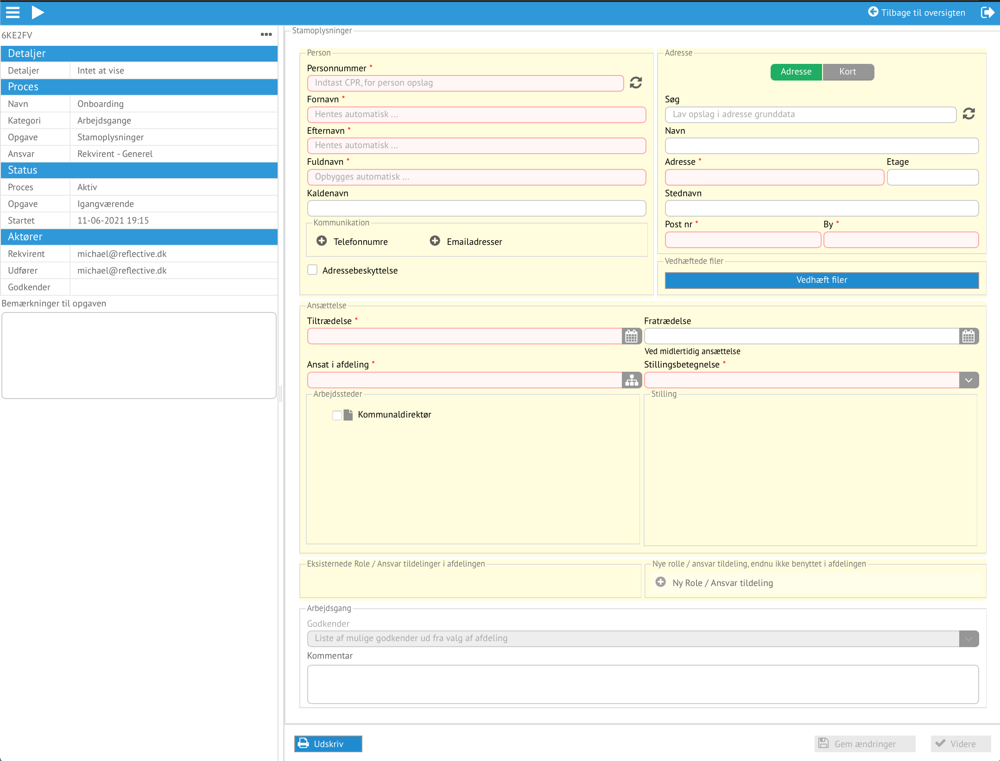

# Vallensbæk

For at tilgå Reflective benyttes den kundespecifikke adresse sat op til single
sign-on:

https://vallensbaek.reflective.dk

Det bringer start billedet med to muligheder

## Onboarding

Reflective benytter standarder, og for at beskrive foretningsgange benyttes
standarden for det som er BPMN.

*Oversigt over arbejdsgangens opgaver i BPMN*

Her vises alle de opgaver som onboarding arbejdsgangen indeholder, hvordan de
hænger sammen og hvilke ansvar som er krævet for at kunne udfører opgaven.
De grønne opgaver er bestilling, de blå godkendelse, de lilla er automatiske og
gule er udførende opgaver, som at opdatere et system med adgange.

*Start onboarding arbejdsgangen start menuen*

Bestilleren starter en onboarding, fra start menuen.

### Stamoplysninger

*Stamoplysninger*

Den første opgave er stamoplysninger om ansættelsen, som automatisk tildeles
bestilleren, der også bliver processens ejer.

Ved at angive cpr, hentes person og adresse automatisk fra grunddata. Herefter
angives hvornår personen starter i ansættelsen, hvor i organisationen
ansættelsen tilhører og stilling.

Foretningsrolle/ansvar kan angives, fx om ansættelsen er en leder.

Reflective fremfinder nærmeste leder ift. ansættelsen, leders leder og
stedfortrædere som kandidater til godkendelse af onboarding bestilling. Den
nærmeste leder forvælges.

Det er muligt at gemme og vende tilbage til opgave oversigten. Først når alle
obligatoriske felter er udfyldt, er et muliget at gå videre til "Bestilling"
opgaven.

### Bestilling

*Bestilling af løn, systemadgange, kurser og andet*

En bestilling er opbygget af op til fire dele: Løn, Systemadgange, Kurser og
Attester / Andet.

Alt efter hvor ansættelsens afdeling, rolle/ansvar og stilling, vil Reflective
filtrer de profiler som er relevant. Profiler har en kategori som afgør hvilket
område de præsenteres i for bestilleren.

Teksten på knapperne/fanerne er hhv. røde når der er obligatoriske felter der
mangler at blive udfyldt, de den tilhørende formular og **fed** når der er lavet
ændringer i dem.

Udfyld lønoplysningerne og vælg Systemadgange.

Tryk videre.

*Bestilling af løn, systemadgange, kurser og andet*

Profilen for AD bruger er obligatorisk, og skal udfyldes. Vælg alle profiler,
ved at åbne dem, og udfyld dem.

Vælg Attester/Andet og vælg her også alle og udfyld attester og telefoni.

Tryk videre.

Reflective danner nu simuleringsregnearket, og vedhæfter det til arbejdsgangen.
Der dannes en brugeropgave til bestilleren, som opstår på opgavebordet når
simuleringsregnearket er dannet. Tryk på ringen med to pile ved siden af i'et
til højre øverst, for at opdatere eller F5.

Vælg Lønsimuleringsopgaven.

### Lønsimulering

*Lønsimulering*

Her vises de indtastede lønoplysninger og en liste over vedhæftede filer.
Det er her muligt at hente regnearket, og benytte det til lønsimulering. Når
simuleringen er klar, uploades regnearket igen, og ansættelsen sendes til
godkendelses hos godkenderen der blev valg ifm. stamoplysninger.

*Lønsimulering*

Tryk send.

### Godkend

*Nederste del af Godkend*

Godkenderen får opgaven, som kan findes ved at vælge "Alle opgaver" fra
rullegardinet: "Filtrering af dine opgaver".

Hele bestillingen vises for godkenderen, som kan Afvise eller Godkende ansættelsen.
Når der er en udfører på en opgave, skal den først overtages.

Hvis opgaven afvises, skal der gives en begrundelse, hvorefter bestilleren, får
Stamoplysninger opgaven igen, stadig udfyldt og med begrundelsen for afvisningen,
således den kan blive rettet og send til godkendelse igen.

Da opgaven er allokeret til en udfører, skal den først overtages, ved at trykke
Tag object.
For at godkende skal Godkend checkes af, og tryk Godkend.

### Oversigt over arbejdsgangens opgaver

*Oversigt over arbejdsgangens opgaver*

Ved at filtrer på ansættelses processen og "Opgaver som rekvirant", vises alle udestående
opgaver. På kortene viser, hvem om nogen der har påtage sig opgaverne. Når alle
opgaver er udført overføres processens data til produktion. Under opgaveløsningen
i processen holdes data i en klade, kun synlig for dem som udføre opgaverne.

Profiler/allokeringer til fx. CID samles i en opgave.

Vælg Attester

### Opgaveløsning

#### Attester

*Attester*

Opgaven er automatisk givet til bestilleren som står for at indhente de
bestilte attester, og angiv evt. anmærkninger i bemærkninger.

Vælg Send

Godkenderen får herefter Attester opgaven, som kan Godkendes eller processen kan
anulleres.

#### AD Opdateringer

*AD Bruger*

To opgaver går til udfører, som har ansvar for AD opdateringer. Først opgave viser
AD Bruger profilen til kontrol med mulighed for ændringer.

Vælg Videre

*List AD Adgange*
